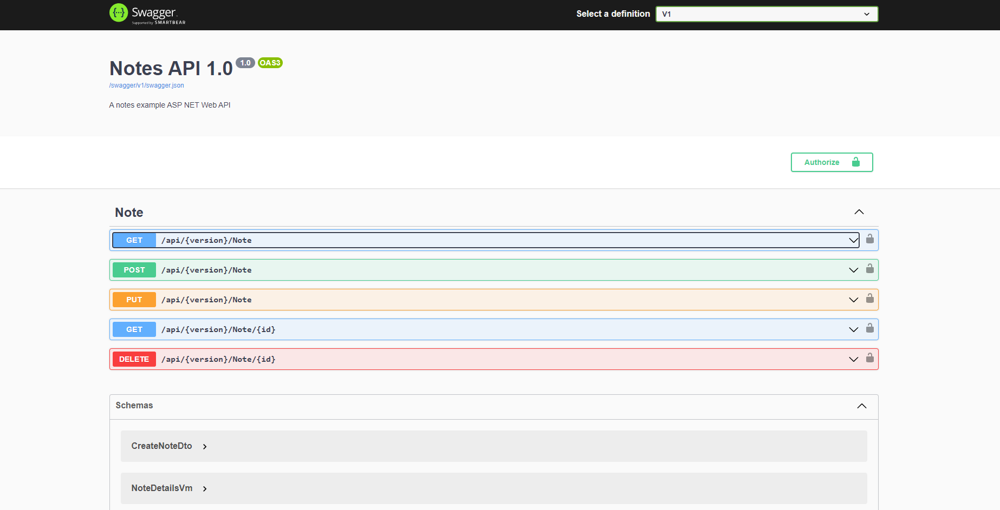

# Приложение для работы с заметками

Разработано приложения для работы с заметками с возможность авторизации пользователя.
Заметки сохраняются в базу данных SQlite.
Приложение поддерживает версионирование.

В работе использовались технологии:

_1. **Entity Framework Code 5.0** для работы с базой данных;_

_2. **Automapper**;_

_3. **MediatR** для разделения запросов и модификаций;_

_4. **Dependency Injection**;_

_5. **Fluent Validation** для валидации данных с Fluent API;_

_6. Написание собственного **Middleware** для обработки исключений;_

_7. **IdentityServer4** для написания своего сервиса авторизации пользователя;_

_8. **Swagger** для документирования кода;_

_9. Поддержка нескольких версий Web API._

